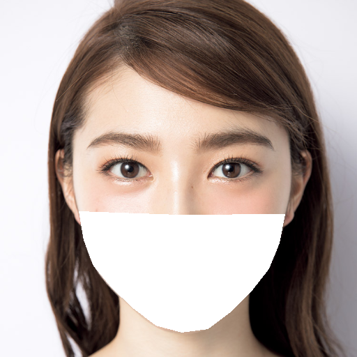
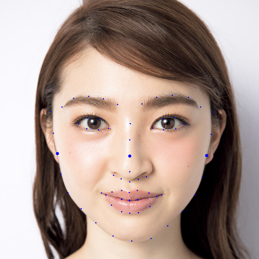
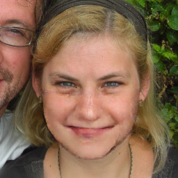

# マスク除去AIwebアプリのマスク除去AIの部分
## 概要
人の顔画像のデータセットから擬似マスクデータセットを作成し，入力：疑似マスク画像，正解：もともとの顔画像として，Pix2Pixを学習し，マスク除去AIを作成．

サービス本体のリポジトリ → https://github.com/pepepor123/hackathon-imp\
デモ動画 → https://www.youtube.com/watch?v=oXvH-DxO5X8&feature=youtu.be

## 疑似マスク画像の生成方法

疑似マスク画像

1. 顔のランドマークを取得(dlibを使用)
2. 下の画像で青丸が大きくなっている点を参考に顎の輪郭に沿って白く塗りつぶし

## 生成例(左が生成画像で右が正解画像)

